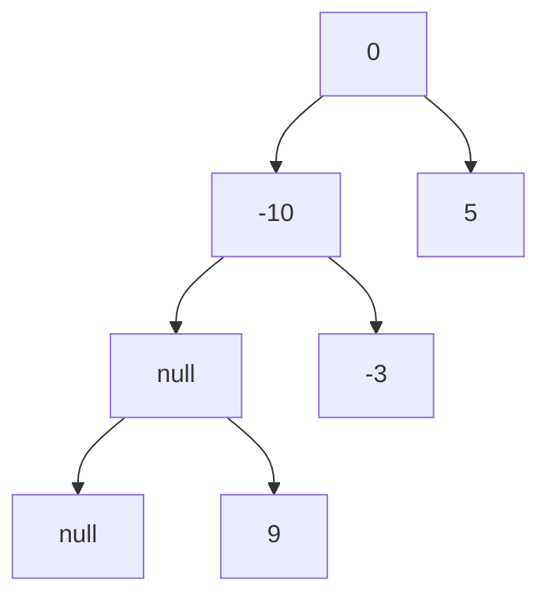

# Sorted Array to Balanced BST
- arr = [-10, -3, 0, 5, 9]
- use mid = st + (end - st)/2
- The final balanced tree:

```mermaid
graph TD;
A[0]-->B[-10];
B-->C[null];
B-->D[-3];
A-->E[5];
C-->F[null];
C-->G[9];
```
