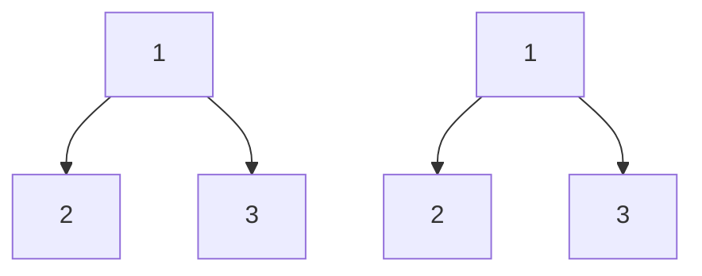
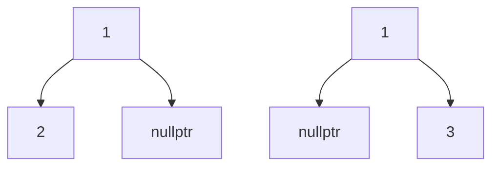

# Identical Tree (Leetcode 100)
- Given the roots of two binary trees p and q, write a function to check if they are the same
- Two binary trees are considered the same if they are structurally identical and nodes have same values

- Answer is true for the above

- Answer is false for the above

