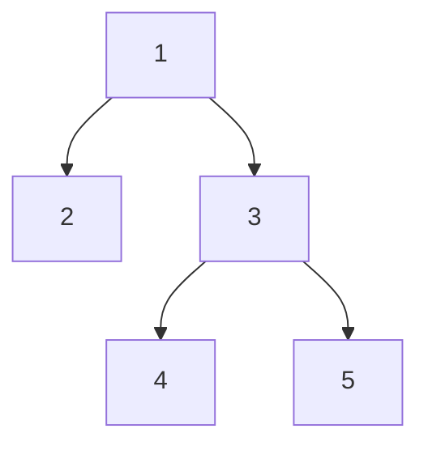

# Level Order Traversal
- root, left, right is the order to be followed

- 1,2,3,4,5 will be the sequence

## Approach
- We will use the queue data structure
```cpp
q.push(root)
while(q.size()>0)
{ 
    Node* curr = q.front(); 
    q.pop();
    cout<<curr->data;

    if(curr->left!=nullptr)
        q.push(curr->left);
    if(curr->right!=nullptr)
        q.push(curr->right);
}
```
