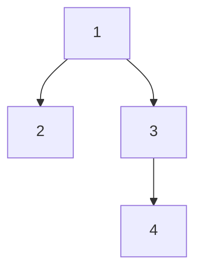

# Binary Tree Paths (LeetCode 257)
- Suppose the following tree:

```mermaid
graph TD;
    A[1]-->B[2]
    A[1]-->C[3]
    C[3]-->D[4]
```
## Paths
- Given the root of a binary tree, return all root paths in any order
