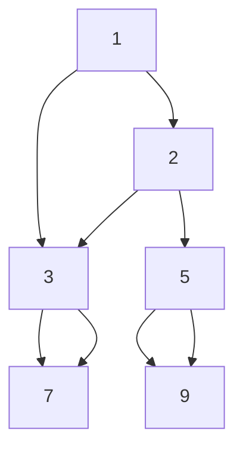

# Lowest Common Ancestor (Leetcode: 236)
- Find LCA for the two nodes 'p' and 'q'
- Suppose the following tree: p is 5 and q is 7

- A node is an ancestor of the own
- The answer will be 1 in this case
- Redefinition of the problem: Find the node for which, p and q exists in the subtrees
