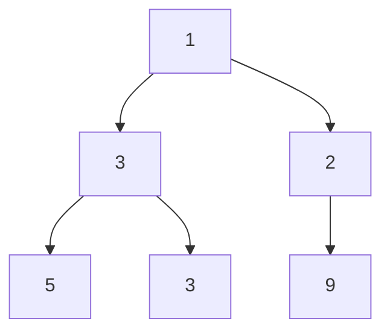

# Maximum Width of Binary Tree (LeetCode: 692)
- Longest length between the end-nodes where the null nodes between the end-nodes that would be present in a complete binary tree

- For the above tree, it is 4
- We will use the concept of Complete Binary Tree Index (CBT)
- An array will be used
- The array will be: 1 3 2 5 3 '' 9
- General formula for width at a level: endIdx - stIdx + 1
