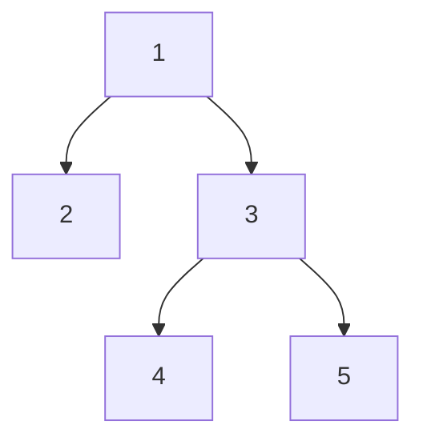

# Top View of the tree
- Suppose the following tree:

- The top view will be: 2 1 3 5
- 4 isn't printed because it is directly below 1

## Horizontal Distance and Level Order Traversal
- root = origin, left= -1 and right = +1
- Find the distance for each node
- See how many elements have the same distance
- If many elements have the same distance, then see which element comes first in the level order traversal, then print it
