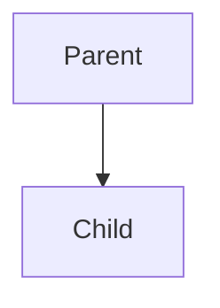
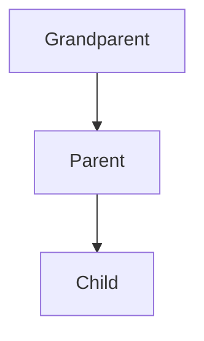
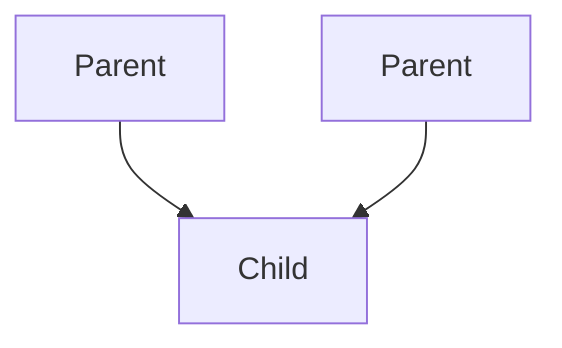
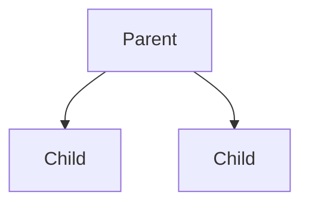
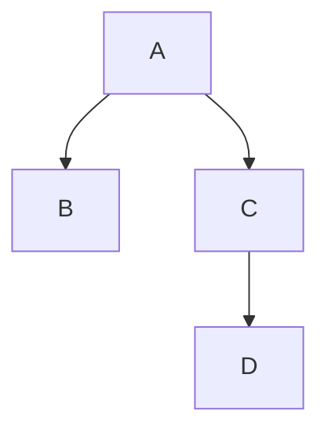

# All Definitions of important terms

## Pillars of OOPS
- Encapsulation
- Abstraction
- Inheritance
- Polymorphism

## Classes and Objects
- Objects are entities in the real world
- Class is like a blueprint of these entities
- Examples: Cookie shaper and cookie, car blueprint and actual cars etc.

## Access Modifiers
- `private` : data and methods accessible inside class
- `public` : data and methods accessible to everyone
- `protected`: data and methods accessible inside class and to its derived class

## Encapsulation
- Wrapping up of data and member functions in a single unit called class
- Data hiding: private

## Constructors
- A method automatically invoked at the time of object creation. Used for initialization
- Same name as class
- Constructor doesn't have a return type
- Only called once (automatically), at object creation
- Memory allocation happens when constructor is called
- Types: Parameterized, non-parameterized and copy constructor
- Different no. or types of constructors: constructor overloading: polymorphism

## `this` keyword
- Is a special pointer in C++ that points to the current object
- this->name is exactly same as *(this).name

```
- Example of a constructor:
Teacher(string name, string subject)
{
    this->name = name; //name on the left is a private variable of class Teacher and name on the right is the function parameter
    this->subject = subject;
}
```

## Copy Constructor
- Special Constructor (default) used to copy properties of one object into another
- Teacher t2(t1); `t2` get all the properties of `t1`

## Shallow Copy and Deep Copy
- A shallow copy of an object copies all the member values from one object to another.
- A deep copy, on the other hand, not only copies the member values but also makes copies of any dynamically allocated memory that the member points to.

## Destructor
- Opposite of constructor
- `~ClassName(){}`

## Inheritance
- When properties and member functions of `base/parent` class are passed on to the `derived/child` class.
- When object of derived class is created, first the constructor of the parent class is called
- For destructors, it is the opposite: first the child then the parent

## Modes of Inheritance
|| Derived Class | Derived Class | Derived Class|
|:-----:|:------|-------|:-----|
|Base Class| Private Mode | Protected Mode | Public Mode|
|Private| Not Inherited | Not Inherited | Not Inherited|
|Protected| Private | Protected | Protected |
|Public| Private| Protected | Public|

## Types of Inheritance

### Single Inheritance



### Multi-level Inheritance


### Multiple Inheritance

> class child: public parent1, public parent2{};

### Hierarchical Inheritance


### Hybrid Inheritance


## Polymorphism
- Ability of objects to take on different forms or behave in different ways depending on the context in which they are used
- Example: Constructor Overloading
- Types: Compile Time Polymorphism and Run Time Polymorphism
- Compile: Constructor/function overloading, operator overloading
- Run Time: Function overriding - Parent and Child both contain the same function with different implementation. The parent class function is said to be overridden. Child's object created, then the child's function is called. If parent's object is created, then the parent's function is called
- Run Time: Virtual Functions - Is a member function that you expect to be redefined in derived classes
### Virtual Functions
- Dynamic in nature
- `virtual` keyword defined inside the base class and are always declared with a base class and overridden in a child class
- A virtual function is called during Runtime

## Abstraction
- Hiding all unnecessary details and showing only the important parts
- Access modifiers/specifiers: data hiding using private
### Abstract Classes
- Used to provide a base class from which other classes can be derived
- They can't be instantiated and are meant to be inherited
- Are typically used to define an interface for derived classes
